# ***GitHub GitBash Jenkins and Docker Integration***

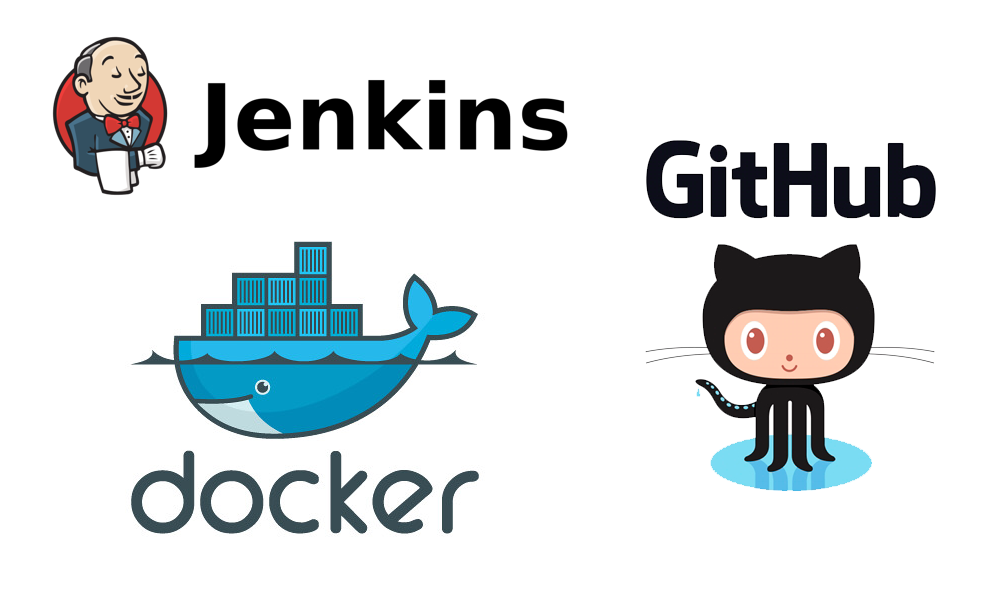
### Task Details:
1. Create container image that’s has Jenkins installed using dockerfile

2. When we launch this image, it should automatically starts Jenkins service in the container.

3. Create a job chain of job1, job2, and job3 using build pipeline plugin in Jenkins

4. Job 1 : Pull the Github repo automatically when some developers push repo to Github

5. Job 2 : By looking at the code or program file, Jenkins should automatically start the respective language interpreter install image container to deploy code ( eg. If code is of PHP, then Jenkins should start the container that has PHP already installed ).

6. Job 3 : Test your app if it is working or not if app is not working , then send email to developer with about the error

### Process to push to git hub:
* we have discussed this process in detail in my previous blog: [here](https://www.linkedin.com/pulse/task-1-github-jenkins-docker-integration-gaurav-pagare/?trackingId=xTY%2FiTdXQs%2BPSl9lcNkGlw%3D%3D)

so, here I am sharing these screenshots

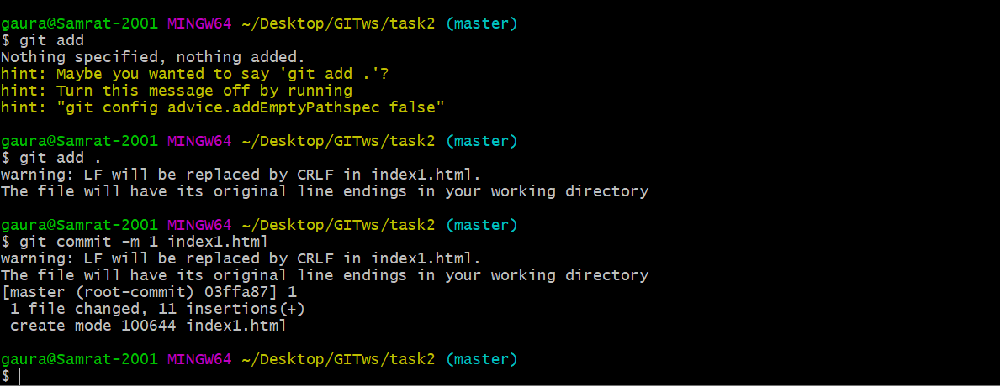
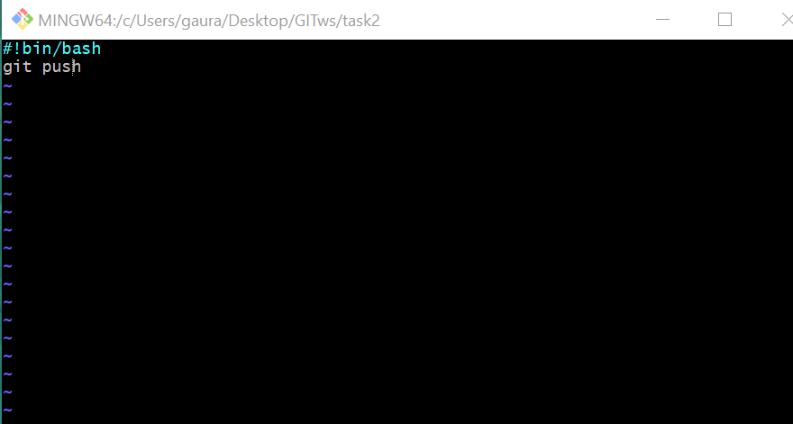
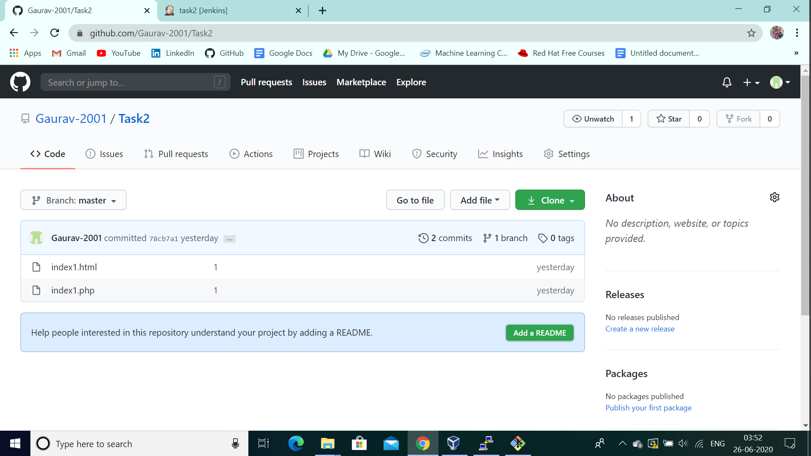

1. At the most we will make our Dockerfile in which we have jenkins and the Docker installed
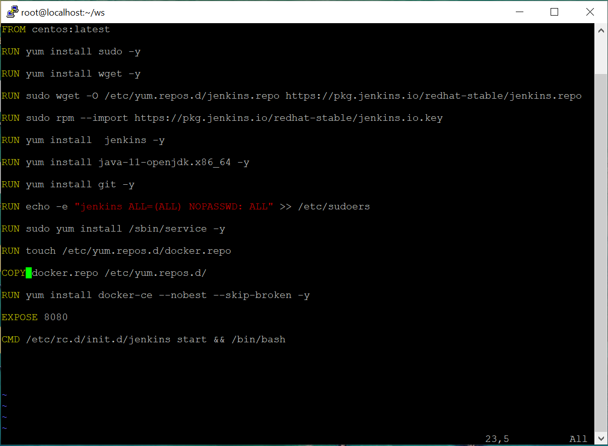

2. Next built the image Here I have gave jenkins_image:v1 as name of my image
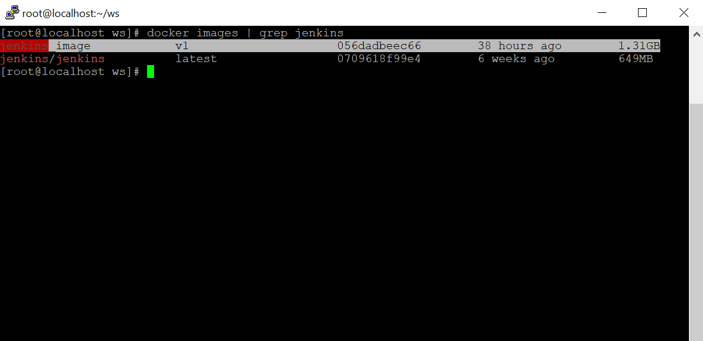

3. Launch the docker container : docker run --privileged -it -P -v /var/run/docker.sock:/var/run/docker.sock -v /root/test:/root/test --name myjen1 jenkins:v1

4. Check the port of the container and then from browser connect to http://<IP_of_host_OS >:<port_number>
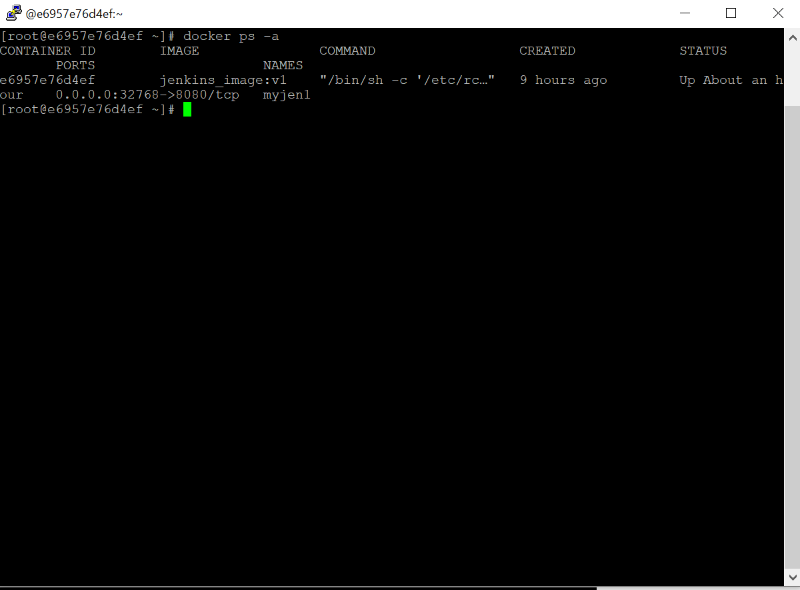

5. From the folder mentioned below retrive the password and get access to jenkins
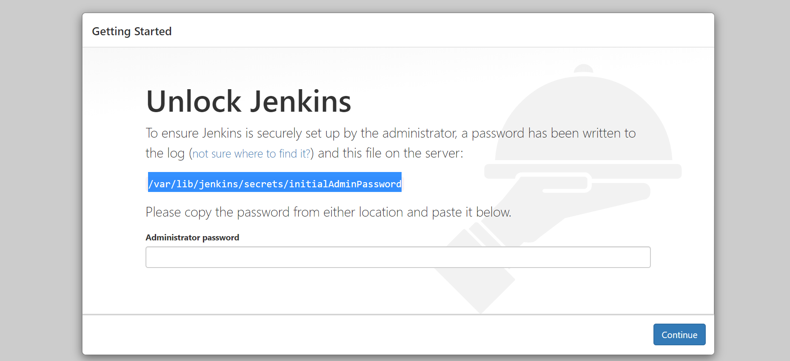

6. Job1: get data from github
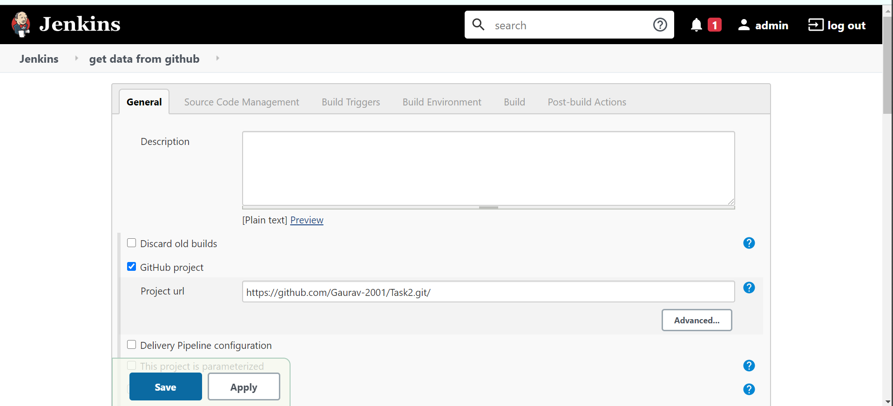
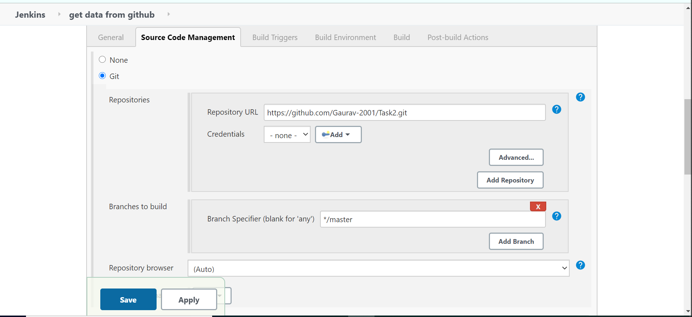
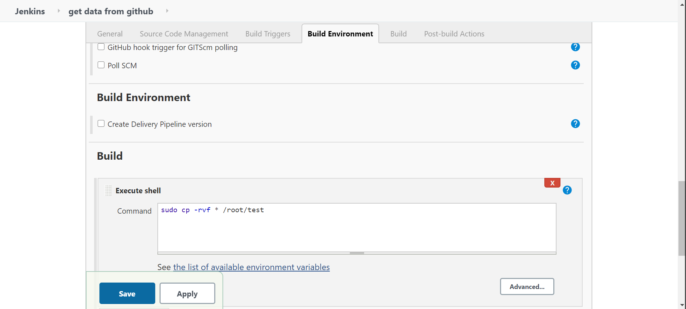

7. Job2: create container
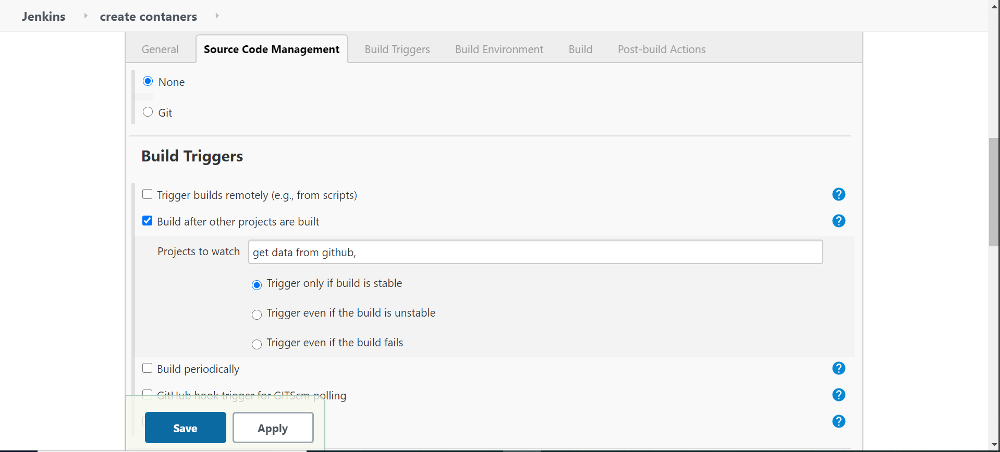
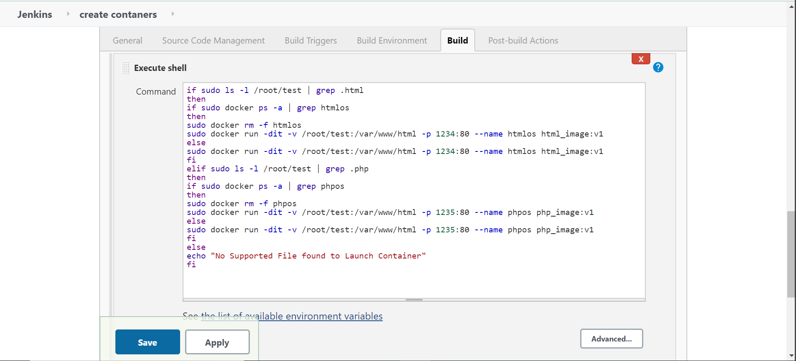

8. Job3: test container
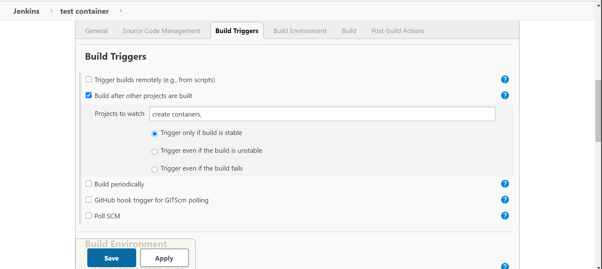
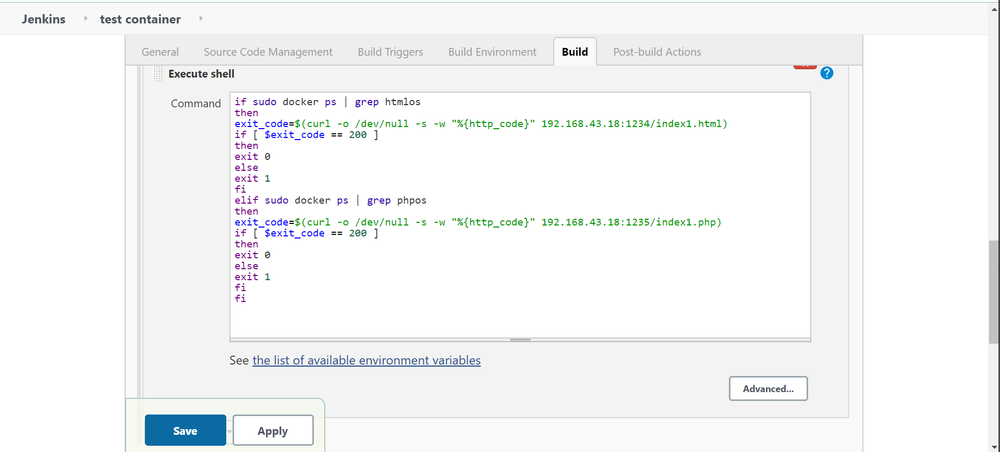
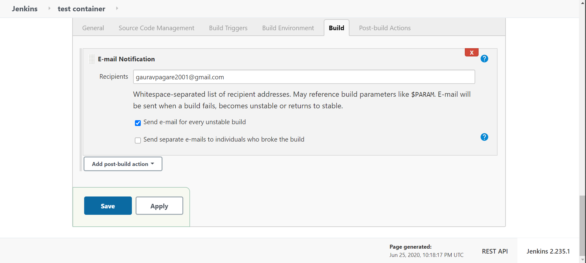
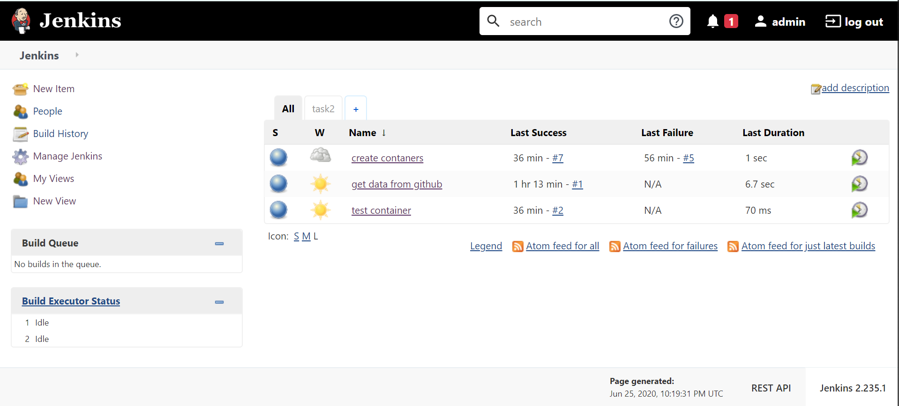

9. Create the pipeline:
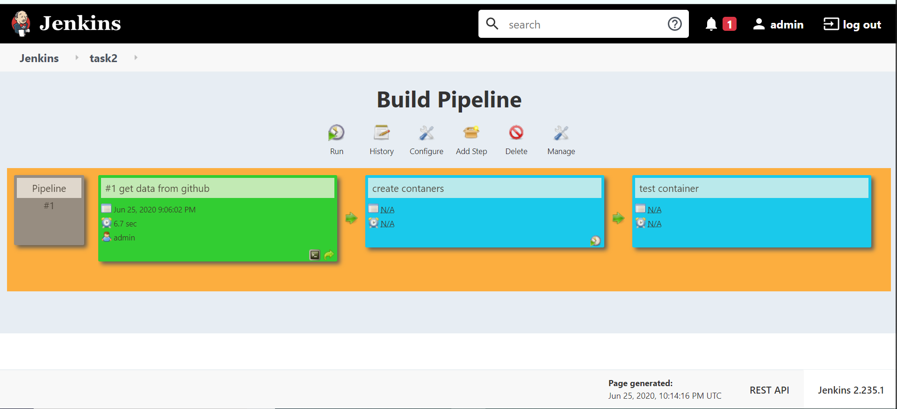

### Approach:
* In this task I have made an jenkins image with docker installed in it (i.e we can access the docker running over our host from this container also)
* I succesfully launched the container for running the html and php code. with there respective images.
References : [email]( https://pepipost.com/tutorials/install-and-configure-email-notifications-in-jenkins/)

> ***At the last I am very much thank full to Mr. Vimal Daga Sir for making us skilled at such an level. l would also thanks the volunteers who worked for us almost 24 hr. to clear our doubt THANK YOU***
